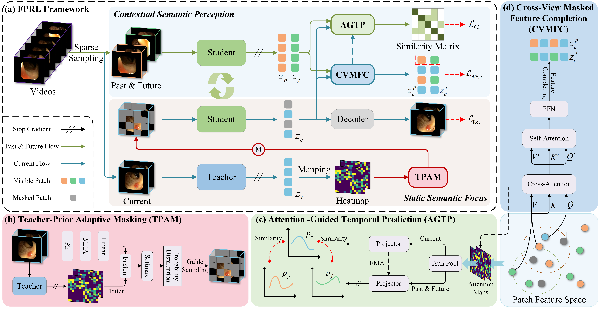

# FPRL



This repository provides the official PyTorch implementation of the paper **Focus-to-Perceive Representation Learning: A Cognition-Inspired Hierarchical Framework for Endoscopic Video Analysis**, which has been accepted by **CVPR 2026**.  


---

## Installation
We can install packages using provided `environment.yml`.

```shell
cd FPRL
conda env create -f environment.yml
conda activate FPRL
```

## Data Preparation
We use the datasets provided by [Endo-FM](https://github.com/med-air/Endo-FM) and are grateful for their valuable work.

## weights
pretrain weight:

[pretrain](https://pan.baidu.com/s/1bu5s1-oi42mG74sF7EI21A?pwd=grvq)

downstream weight:

[Classification](https://pan.baidu.com/s/1Wki0mUwxRfyT9ZOg7Ju_5Q?pwd=4yvd)

[Segmentation](https://pan.baidu.com/s/1qrSVpMcdeCk7T-lHO7LvEA?pwd=tymi)

[Detection](https://pan.baidu.com/s/164hNkuOGVXHs_8HEt-wHQQ?pwd=rpn4)

[Recognition](https://pan.baidu.com/s/164hNkuOGVXHs_8HEt-wHQQ?pwd=rpn4)

## Pre-training
```shell
cd FPRL/videomamba
bash scripts/pretrain.sh
```

## Fine-tuning
```shell
# PolypDiag (Classification)
cd FPRL/videomamba
bash scripts/cls_ft.sh

# CVC (Segmentation)
cd FPRL/videomamba
bash scripts/seg_ft.sh

# KUMC (Detection)
cd FPRL/videomamba
bash scripts/det_ft.sh

# Cholec80 (Recognition)
cd FPRL/videomamba
bash scripts/rec_ft.sh
```

## Acknowledgement
Our code is based on [Endo-FM](https://github.com/med-air/Endo-FM), [VideoMamba](https://github.com/OpenGVLab/VideoMamba), [EndoMamba](https://github.com/TianCuteQY/EndoMamba), and [MMCRL](https://github.com/MLMIP/MMCRL). Thanks them for releasing their codes.


## Citation
```
@inproceedings{zhang2026fprl,
  title={Focus-to-Perceive Representation Learning: A Cognition-Inspired Hierarchical Framework for Endoscopic Video Analysis},
  author={Zhang, Yuan and Dou, Sihao and Hu, Kai and Deng, Shuhua and Cao, Chunhong and Xiao, Fen and Gao, Xieping},
  booktitle={Proceedings of the IEEE/CVF Conference on Computer Vision and Pattern Recognition},
  year={2026}
}
```
